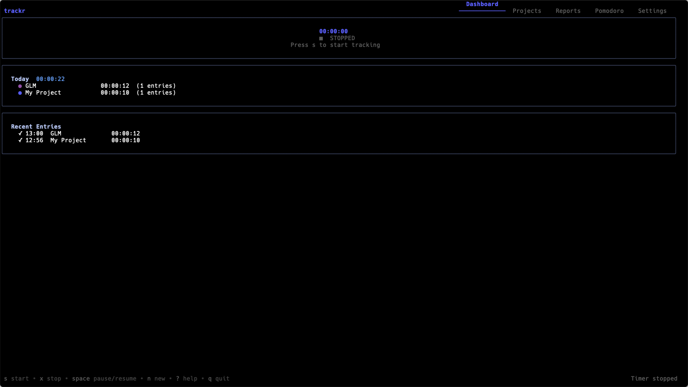
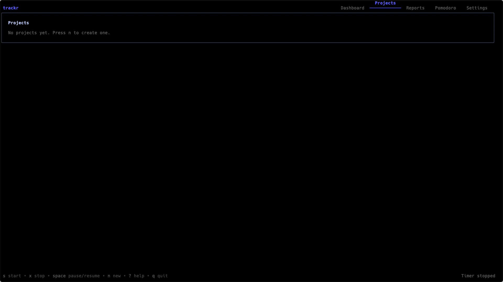
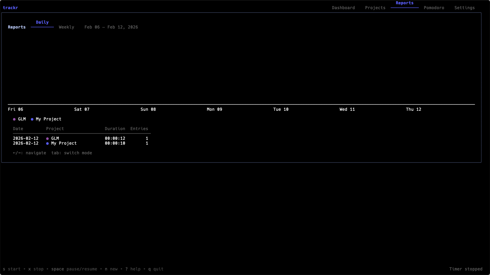
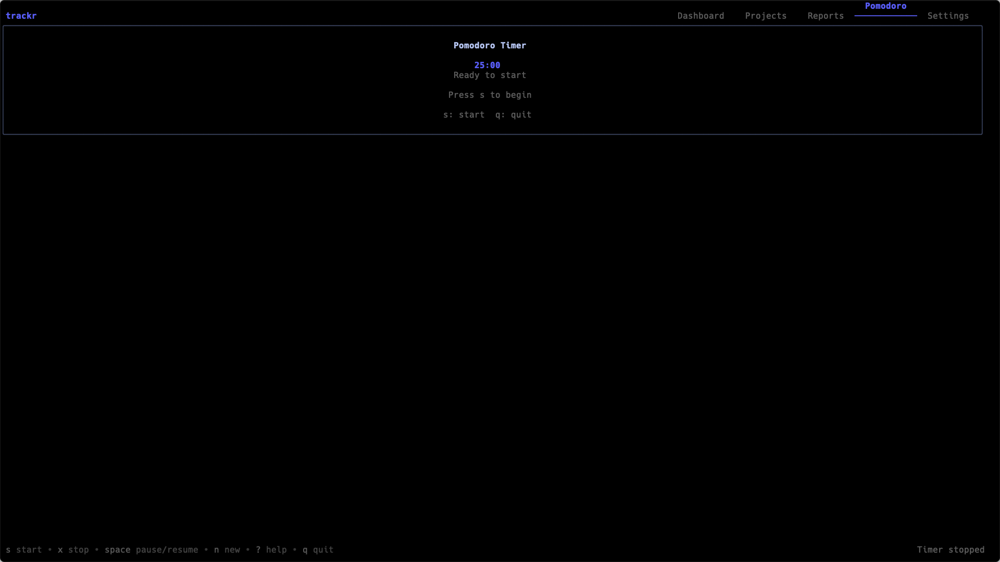
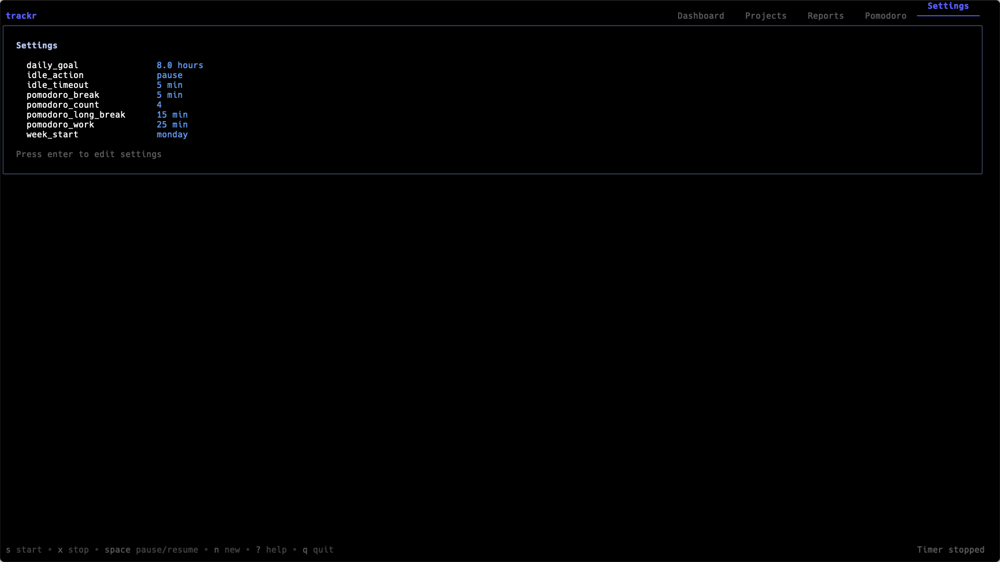

# trackr

A beautiful terminal-based time tracker built with Go and [Bubble Tea](https://github.com/charmbracelet/bubbletea). Track your work, manage projects, view reports, and run Pomodoro sessions — all without leaving the terminal.



## Features

- **Timer** — Start, stop, and pause time tracking with a single keypress
- **Projects & Tasks** — Organize entries by project and task with color-coded labels
- **Dashboard** — Live timer display, today's summary, and recent entries at a glance
- **Reports** — Daily and weekly bar charts with per-project breakdowns
- **Pomodoro** — Built-in Pomodoro timer with configurable work/break cycles
- **Export** — Export all entries to CSV or JSON
- **Idle Detection** — Auto-pause when idle, configurable timeout and action
- **Settings** — Customize Pomodoro durations, daily goal, idle behavior, and more
- **Local Storage** — All data stored in a local SQLite database, no account needed
- **Zero Dependencies** — Single binary, no CGO, cross-compilable

## Screenshots

| Projects | Reports | Pomodoro | Settings |
|----------|---------|----------|----------|
|  |  |  |  |

## Install

### From source

```bash
go install github.com/sadopc/trackr@latest
```

### Build locally

```bash
git clone https://github.com/sadopc/trackr.git
cd trackr
go build -o trackr .
./trackr
```

## Key Bindings

| Key | Action |
|-----|--------|
| `s` | Start timer |
| `x` | Stop timer |
| `space` | Pause / resume |
| `n` | New project / task |
| `d` | Archive project |
| `e` | Export (CSV / JSON) |
| `1`–`5` | Switch tabs |
| `tab` | Next tab |
| `?` | Toggle help |
| `q` | Quit |

## Data Storage

trackr stores data in a local SQLite database:

- **macOS:** `~/Library/Application Support/trackr/trackr.db`
- **Linux:** `~/.config/trackr/trackr.db`

Exports are saved to your home directory as `~/trackr-export-{date}.csv` or `~/trackr-export-{date}.json`.

## Tech Stack

- [Bubble Tea](https://github.com/charmbracelet/bubbletea) — TUI framework
- [Lip Gloss](https://github.com/charmbracelet/lipgloss) — Styling and layout
- [Bubbles](https://github.com/charmbracelet/bubbles) — TUI components
- [Huh](https://github.com/charmbracelet/huh) — Terminal forms
- [ntcharts](https://github.com/NimbleMarkets/ntcharts) — Terminal bar charts
- [modernc.org/sqlite](https://pkg.go.dev/modernc.org/sqlite) — Pure Go SQLite (no CGO)

## Testing

```bash
go test ./... -count=1
```

122 tests across store, TUI, and export packages.

## License

MIT
